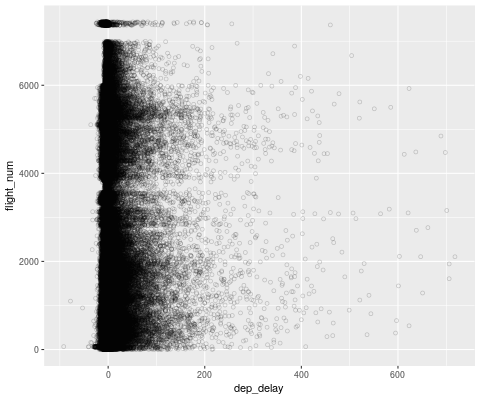

```{r setup, include=FALSE}
knitr::opts_chunk$set(echo = TRUE,
                      message = FALSE,
                      warning = FALSE,
                      cache = TRUE)
```

```{r libraries}
# import libraries
library(tidyverse)
library(lubridate)
library(viridis)
theme_set(theme_bw())
```
# Outline

# Introduction

In today’s day and age where the consumer has zero tolerance for inefficiencies, one can’t help but wonder how flight delays are still prevalent. How can multimillion dollar airlines fail to anticipate these at a consistent basis? It is certainly to the benefit of all parties involved that they don’t occur, so how come one in three flights is delayed? As frequent flyers and curious data scientists, we set out to explore the natural phenomenon that is flight delays and its causes. Can we find a common denominator amongst delays?

The team consists of four members where each analyzed a specific variable’s impact on flight delay:
- Eric Boxer: time, date, day of the week, destination.
- Kai Kang: destination airport, destination states.
- Ioannis Tzemos: distance ................
- Costas Vafeades: day of the week, makeup delay, arrival delay.

On top of the contributions listed above, every member took it upon himself to further add value. A visualization aficionado, Eric produced half of the interactive plots found in our main analysis and maintained our project repository. Kai, a teamwork veteran, kept notes and led the discussions in our weekly meetings. Our efficiency expert Ioannis produced the other half of the interactive plots and optimized our pipeline’s run-time. Finally, as meticulous as can be, Costas provided structure by producing agendas and schedules for the group and set up the data pipeline with Eric.


# Description of data

# Analysis of data quality
## Pipeline
[__Here__](https://github.com/Ecboxer/BKTV_Project/blob/master/pipeline_opt.R) is our script.  
Having downloaded the data as three csv files (one for each of October, November and December 2017) we wrote an R script to construct features for departure and arrival delays and output two csvs, one of the full dataset and another of a representative random sample.  
The steps of the pipeline are as follows:  
* Bind the csv files of October, November and December flights by row.  
* Rename the columns of the combined dataframe for easier access.  
* Format departure and scheduled departure times from 'HH:MM' to 'YYYY:mm:dd HH:MM:00' and take their difference to get find departure delay, in minutes.  
* Repeat the previous step for arrival and scheduled arrival times to find arrival delays.  
Since the full data set contains 1.4 million rows, in the interest of quick computations and visualizations in the exploratory data analysis phase, we took a random sample of 150 000 rows from the processed data. 150 000 was arrived at as a compromise between the processing speed of a small sample and the representativeness of a large one.

```{r load data}
#Import sampled and full datasets
df_sample <- read_csv('cleanest_sample.csv')
df <- read_csv('clean.csv')
```

## Missing values
```{r missing values}
colSums(is.na(df)) / nrow(df)
```

Of the features included in our final dataset, departure time, arrival time, departure delay and arrival delay were missing values for 0.7% of observations. Cancellation code had missing values for 99% of observations.

```{r delay missing values}
extracat::visna(df)
```

The dominant missing data pattern is for observations to be missing only cancellation code. Infrequently, observations are missing departure and arrival times, but we felt that all observations missing either of those values could be removed without losing information about delay durations.

```{r cancellation missing values}
df %>% filter(is.na(canc_code) & cancelled == 1) %>% nrow()
```

No observations missing a cancellation code can easily be found to have been incorrectly entered, because there are no cases in which cancellation code is missing but the data tells us that the flight was actually cancelled.

```{r cancellation look}
df %>% filter(!is.na(canc_code)) %>%
  group_by(canc_code) %>%
  summarise(n = n()) %>%
  ggplot() +
  geom_bar(aes(reorder(canc_code, -n), n), stat='identity') +
  xlab('canc_code')
```

Cancellation codes are encoded by cause of cancellation as follows: A Carrier, B Weather, C National Air System, D Security. Security cancellations accounted for a tiny proportion while weather cancellations were the most frequent. We opted to forgo further investigation of cancellations. Since these flights never departed, there is no delay information from any of these observations in the dataset.

## Explain metadata
The final features are as follows:  
* date: flight date in the format YYYY-mm-dd  
* carrier: a unique two-letter carrier code for each airline, ie 'AA' for American Airlines  
* flight_num: a unique four-digit number for each flight  
* origin: a unique five-digit number for each origin airport, with all of these located in New York State  
* dest: similar to origin but for each destination airport and located in any US state  
* dest_state: a two-digit code for the flight destination state or US territory  
* sched_dep: scheduled departure time in the format YYYY-mm-dd HH:MM:00  
* dep: actual departure time in the same format  
* sched_arr: schedulaed arrival time in the same format  
* arr: actual arrival time in the same format  
* cancelled: indicator of flight cancellation, with 1 corresponding to a cancelled flight and 0 otherwise  
* canc_code: specifies the reason for cancellation  
* distance: distance between origin and destination airports, in miles  
* weekday: a string corresponding to the day of the week of the flight date  
* dep_delay: departure delay, in minutes. Negative values correspond to flights that departed before schedule, positive values with flights that departed after they were scheduled  
* arr_delay: similar to dep_delay but for arrival delay  

## Filtering
For the remainder of the data exploration we removed observations with missing values in the departure and arrival delay features. Then, we removed those observations with departure or arrival delay less than 2 hours or greater than 6 hours. In processing the data there were a small percentage of flights which were scheduled to depart/arrive before midnight but had actual times after midnight (or were scheduled for after midnight but had actual times before). As a consequence of our method for calculating delay (taking the difference of scheduled and actual times), those observations came out with delays of magnitude plus-minus 1440 (the number of minutes in one day). Keeping those observations would introduce extreme outliers. Since this happened to about 1% of the data we decided to exclude these observations from the analysis.
```{r exclude outliers}
df %>% 
  filter(dep_delay < -1200 | dep_delay > 1200 | arr_delay < -1200 | arr_delay > 1200) %>% 
  nrow() / nrow(df)
```

```{r filtering illustration, eval = FALSE}
df_sample %>% 
  ggplot() +
  geom_point(aes(dep_delay, flight_num), alpha=.2, shape=1)
```

The decision to keep data with delays in the range [-120, 720] was in part due to the roundess of those values. In addition, the delay data tended to fall within that range so filtering here will serve to remove outliers from the remainder of our analysis.

```{r clean data}
# Delete NA rows, which indicate flight cancellations
df_sample <- df_sample %>%
  filter(!is.na(dep_delay) & !is.na(arr_delay))
df <- df %>%
  filter(!is.na(dep_delay) & !is.na(arr_delay))

# Subset data with relevent dep_delay and arr_delay values
df_sample <- df_sample %>%
  filter(arr_delay >= -120 & arr_delay <= 720 & dep_delay >= -120 & dep_delay <= 720)
df <- df %>%
  filter(arr_delay >= -120 & arr_delay <= 720 & dep_delay >= -120 & dep_delay <= 720)
```

# Main analysis (Exploratory Data Analysis)

Our data exploration starts by first looking at variables that might help explain the delay:
- Date
- Day of the Week
- Time of Departure
- Distance
- Destination Airport
- Carrier
Naturally, we then proceed to examine whether delays can be ammended for by examining its relationship with the following variables:
- Arrival Delay
- Destination Airport
- Destination State


### Date

DATE PLOTS

### Day of the Week

How are flights distributed throughout a week? Which day is most popular for travelling?
```{r}
num_flights <- df %>% group_by(weekday) %>% summarize(count = n())
num_flights$perc <- num_flights$count / sum(num_flights$count)
num_flights$weekday <- factor(num_flights$weekday, levels = c('Monday', 'Tuesday', 'Wednesday', 'Thursday', 'Friday', 'Saturday', 'Sunday'))

ggplot(num_flights, aes(weekday, perc)) +
  # plots
  geom_col(fill = '#774184' ) +
  # labels
  ggtitle('Percentage of Flights on Each Day') +
  xlab("Day of the Week") +
  ylab("Percentage of Flights")

```

Flights seem to be relatively evenly distributed over all days except Saturdays. This somewhat makes sense, as usually travellers with flights on Saturdays are more likely to be for vacational purposes - and they are more likely to depart on Friday for their destination. How do delays relate to days of the week?

```{r}
ggplot(df, aes(x=weekday, y=dep_delay)) + geom_boxplot(varwidth=TRUE, fill = '#774184') +
  ggtitle('Distribution of Delay on Each Day') +
  xlab("") +
  ylab("Delay in Minutes")
```

The size of our dataset makes it hard for us to visualize the distribution effectively and identify any patterns. One way of going about this is taking the log of our y-axis. Of course, logging negative values would result in erroneous results so we'll focus on positive delays for now. 

```{r}
ggplot(subset(df, df$dep_delay >0), aes(x=weekday, y=log(dep_delay))) + geom_boxplot(varwidth=TRUE, fill = '#774184') +
  ggtitle('Distribution of Positive Delay on Each Day') +
  xlab("") +
  ylab("log(Delay in Minutes)")
```

Evidently, delays are very similar over each day so there's no significant observation to be made. ??? How do negative delays relate to this?

```{r}
df$pos_delay <- ifelse(df$dep_delay > 0, 'Positive', 'Negative')

ggplot(df, aes(x=weekday, y=log(abs(dep_delay)))) + geom_boxplot(aes(fill=factor(pos_delay)), varwidth=TRUE) +
  scale_y_continuous(name = 'log(Delay in Minutes)') + xlab('Day of the Week') + guides(fill=guide_legend(title="Delay")) +
  scale_fill_manual(values=c('#4E8441', '#774184'))
```
It appears that flights are more likely to depart earlier rather than later, but positive delays have greater spread. Early departures also don't seem to vary by day. 

### Time of Departure

TIME OF DEP PLOTS

### Distance

DISTANCE PLOTS

### Destination Airport
```{r}
top_airports <- df %>% group_by(dest) %>% summarize(num_flights = n())
top_airports <- top_airports[order(-top_airports$num_flights), ]
head(top_airports, 10)
```

We can also visualize the distribution of departure delay in our top airports in order to see if flights are more likely to be delayed when headed to more popular destinations.

```{r}
ggplot(subset(df, df$dest %in% head(top_airports$dest, 5)), aes(x=factor(dest), y=log(dep_delay))) + geom_boxplot(varwidth=TRUE, fill = '#774184') +
  ggtitle('Distribution of Positive Delay in the Top 5 Airports') +
  xlab("") +
  ylab("log(Delay in Minutes)")
```


### Carrier

CARRIER PLOTS

SOME DISCUSSION RE: CAUSAL VARIABLES AND HOW THEY AFFECT THE DEPARTURE DELAY. 

### Arrival Delay

How do departure delay and arrival delay relate to each other? Is it possible that the pilot makes up for the delay with a shorter flight, or is it a sign that the flight is going to take even longer? 

```{r Graph 6}
ggplot(df, aes(dep_delay, arr_delay)) +
  geom_hex(bins = 50) + 
  scale_fill_gradientn(colours = viridis(5, direction = 1)) +
  xlab('Departure Delay in Minutes') + 
  ylab('Arrival Delay in Minutes') +
  guides(fill=guide_legend(title="Frequency"))
```

The two variables appear to have a roughly linear relationship, especially at higher values. There are some notable exceptions to this, where a big number of flights experience a high arrival delay even though they had zero departure delay. This can be explained by flights that had trouble landing because the destination airport strips were too busy. 

We can construct a variable called diff_delay that indicates the difference between departure delay and arrival delay. This will allow us to examine whether a departure delay is likely to be ammended for or not. 
```{r}
df$diff_delay <- df$dep_delay - df$arr_delay
```

### Destination Airport

PLOTS SHOWING RELATIONSHIP BETWEEN ARR DELAY, DEP DELAY AND DESTINATION AIRPORT

### Destination State

PLOTS SHOWING RELATIONSHIP BETWEEN ARR DELAY, DEP DELAY AND DESTINATION STATE


```{r destination frequency}
df_n <- df %>% group_by(dest) %>% 
  summarise(n = n(),
            total_delay = sum(dep_delay),
            avg_delay = total_delay / n) %>% 
  arrange(desc(n))
```
```{r number of destinations}
df$dest %>% unique() %>% length() #How many airports in the data? 144
```
```{r destination cleveland}
df_n %>% filter(n > 20000) %>% ggplot() +
  geom_point(aes(reorder(dest, n), n, color=avg_delay), size=6) +
  coord_flip()
```

14771 San Francisco International and 11618 Newark Liberty Intl

```{r destination negative delay}
df_n %>% filter(avg_delay < 0) %>% ggplot() +
  geom_point(aes(reorder(dest, avg_delay), avg_delay, size=n)) +
  coord_flip()
```

```{r destination zero delay}
df_n %>% filter(avg_delay < 1 & avg_delay > -1) %>% ggplot() +
  geom_point(aes(reorder(dest, avg_delay), avg_delay, size=n)) +
  coord_flip()
```

```{r destination high frequency}
df_n %>% filter(n > 25000) %>% ggplot() +
  geom_point(aes(reorder(dest, avg_delay), avg_delay, size=n)) +
  coord_flip()
```


# Executive summary (Presentaion-style)

## Daily Departure Delays
[__Here__](https://bl.ocks.org/ecboxer/6be5cf6fc44449823e08ca5f1b443935) is a visualization of the average departure delay for each date in the dataset. Each month is shown as a calendar heatmap with each week in a row starting on Monday and ending on Sunday. We used a Value Suppressing Uncertainty Scale (VSUP) which decreases the number of distinct colors according to increasing uncertainty, measured in standard mean error of delay time. Hover over a tile to show the precise departure delay.  
Starting in October, we do not see a clear pattern to delays. Tuesdays and Wednesdays have low departure delays for all but one week, the 24th for Tuesdays and the 11th for Wednesdays. In November, there is a similarly varied distribution to delays. Note the scale changes across months, so the 3rd of November is encoded as high delay with a 10 minute average while the 12th of October has a similar average but lies closer to the middle of that month's distribution. The clearest pattern in December is the split between the beginning of the month and the final two weeks. After the 18th, delays are almost all on the higher-end, with the 30th having an average delay of 20 minutes (but also the highest uncertainty).  

## Weekly Departure Delays
[__Here__](https://bl.ocks.org/ecboxer/221d818a4b9fad4feb0ab14e7ca704a1) is a visualization of the average departure delay grouped by day of the week and hour of departure. It was constructed with the same VSUP scale as the daily departure delay visualization. Again, hovering over a tile shows the precise departure delay.  
There are two patterns here: the distinction between weekdays and weekends, and an increase in delay length as a given day progresses. Weekends have a longer period of dark-blue than weekdays (corresponding to delays in the range of 3-9 minutes), and even in the hour before midnight do not reach the same magnitude of delay as do weekdays.  
Across all days, until 9am average delays are small or negative. Afterwards there is a gradual increase in delays until we see an average delay length of 38 minutes in flights departing before midnight on Mondays.  
Note: the choice was made to start the x-axis at 4am since at all previous times the standard mean errors were at least 0.1875 and their values were thus suppressed by our scale.

## Arrival and Departure Delays
```{r Graph 6}
ggplot(df, aes(dep_delay, arr_delay)) +
  geom_hex(bins = 50) + 
  scale_fill_gradientn(colours = viridis(5, direction = 1)) +
  xlab('Departure Delay in Minutes') + 
  ylab('Arrival Delay in Minutes') +
  guides(fill=guide_legend(title="Frequency"))

```
It appears that there's generally a linear relationship between the two variables where the higher the departure delay, the higher the arrival delay. There are some exceptions to this, and it's important to note that a big number of flights have a significantly high arrival delay despite having almost no departure delay.

# Interactive component

# Conclusion

#### Future direction
* Cancellations, ie does the presence of cancelled flights increase the delays for flights that did depart?
* Other origin airports
* Full year/several years